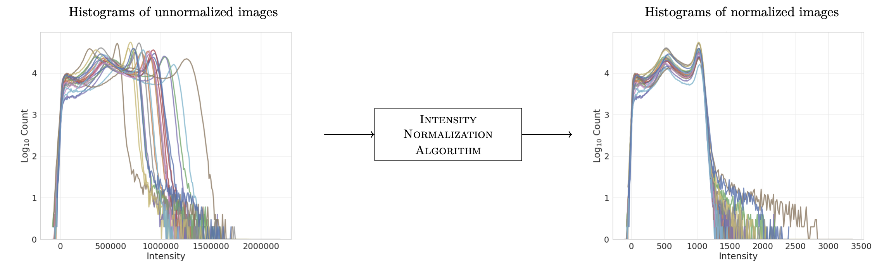

# intensity-normalization

Normalize the intensities of magnetic resonance (MR) images — T1-w, T2-w, FLAIR,
PD-w, and more — across scanners, sites, and sessions.



*Left: foreground intensity histograms of unnormalized T1-w images from the same
scanner and protocol. Right: the same images after (FCM) normalization.*

## Why?

MR images have no consistent intensity scale: the same tissue gets different
intensities across scanners, pulse sequences, and even sessions on the same
scanner. That inconsistency is an acquisition artifact, not a feature of the
data — and it breaks downstream processing, especially machine learning, which
usually assumes the data was drawn i.i.d. from one distribution.

We used this package to explore the impact of intensity normalization on an
image synthesis task ([pre-print](https://arxiv.org/abs/1812.04652)).

## Install

```bash
pip install intensity-normalization
```

Optional extras:

```bash
pip install "intensity-normalization[ants]"   # RAVEL registration, preprocess, coregister
pip install "intensity-normalization[plot]"   # histogram plotting
```

## 30-second example

```python
import intensity_normalization as inorm

normed = inorm.whitestripe(t1w_image, mask=brain_mask)  # numpy or nibabel in, same type out

# population method: fit once, apply to new scans
tx = inorm.nyul.fit(training_images, masks=training_masks)
normed_new = tx(new_image)
tx.save("nyul.npz")
```

or from the command line:

```bash
intensity-normalize whitestripe t1w.nii.gz -m mask.nii.gz -p
```

Next: [Quickstart](quickstart.md) · [Which method should I use?](methods.md)
