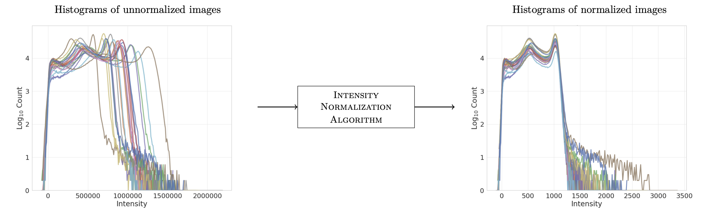

.. intensity-normalization documentation master file, created by
   sphinx-quickstart on Thu May 24 12:18:04 2018.
   You can adapt this file completely to your liking, but it should at least
   contain the root `toctree` directive.

intensity-normalization documentation
===================================================

This package contains various methods to normalize the intensity of various modalities of magnetic resonance (MR)
images, e.g., T1-weighted (T1-w), T2-weighted (T2-w), FLuid-Attenuated Inversion Recovery (FLAIR), and Proton
Density-weighted (PD-w) images.

Intensity normalization is an important pre-processing step in many machine learning applications since MR images do not
have a consistent intensity scale which breaks the iid assumption inherent in most ML methods.

.. toctree::
   :maxdepth: 1
   :caption: Contents:

   exec
   normalization
   plot
   utilities
   algorithm

Indices and tables
==================

* :ref:`genindex`
* :ref:`modindex`
